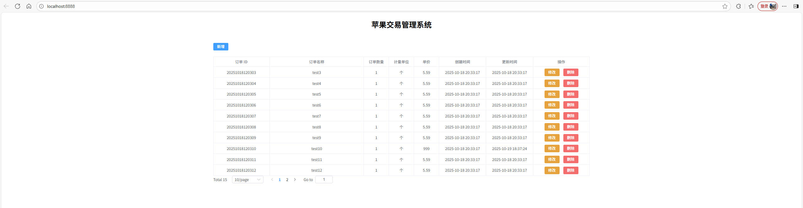

# 项目简介
该项目是一个苹果交易系统，用户可以通过该界面进行交易添加、修改、删除操作。
# 打包部署方式
## 打包方式
```
# 1. 打包命令
npm run build
# 2. 打包结果目录
在项目根目录下有 deploy 文件夹，该文件夹内有 Dockerfile、nginx.conf 及 dist 文件夹。其中，dist 文件夹存放的是 webpack 打包后的文件。
```
## 部署运行方式
### nodeJS 的方式运行
```
# 1. nodeJs 版本：22.20.0
# 2. npm 版本：10.9.3
# 3. 启动命令：
npm run dev
```
### docker 方式运行
```
# 1. 创建 docker 运行环境
创建过程略... ...
# 2. 本项目基于 nginx 的 alpine 镜像制作。在 Dockerfile 目录下，构建 docker 容器，如下：
docker build -t apple_trading_html:v1
# 3. 启动 docker 容器
docker run -d -p 8888:8888 --name apple_trading_html apple_trading_html:v1
```

# 运行界面示例


